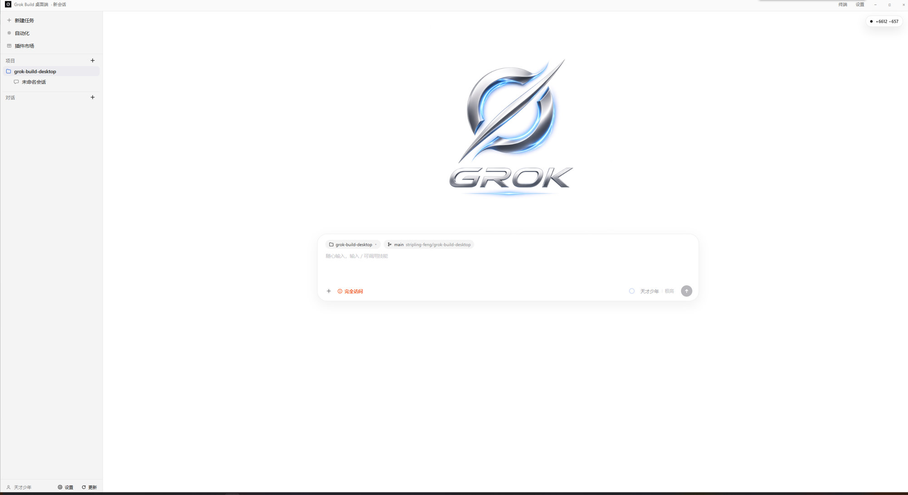

# Grok Build 桌面端

面向 [Grok Build](https://github.com/xai-org/grok-build) 的桌面命令中心。应用是一层轻量 Electron 界面，通过 ACP（`grok agent stdio`）调用本机 `grok` CLI，不会重新实现 Agent。



界面支持中文：左侧管理项目与对话，中间是欢迎页与输入框，可切换权限模式（如「完全访问」）和推理强度。

## 环境要求

- Node.js 22+
- 本机已安装 Grok Build CLI（在 PATH 中，或位于 `%USERPROFILE%\.grok\bin\grok.exe`）

```powershell
irm https://x.ai/cli/install.ps1 | iex
grok --version
```

## 本地开发

```powershell
cd apps/desktop
npm install
npm run dev
```

窗口会复用你现有的 Grok 登录、配置、Skills 和会话，数据在 `~/.grok`。

## Windows 安装包

```powershell
cd apps/desktop
npm run pack:win
```

NSIS 安装包输出到 `apps/desktop/release/`。安装包**不内置** grok CLI；若首次启动检测不到 `grok`，会提示执行官方安装脚本。也可以把 `grok.exe` 放到打包资源旁边，做成捆绑二进制。

单实例：再开一次会聚焦已有窗口。日志在 Electron userData 下的 `logs` 目录（设置 → 打开日志目录）。

## 功能

- 项目侧栏与对话线程（Grok 会话）
- 从 `~/.grok/sessions` 恢复 CLI / TUI 历史
- 流式对话、工具卡片、权限确认
- 本地工作区与 git worktree 线程
- Git 状态 / Diff 面板
- 用 VS Code 或 Cursor 打开文件夹
- 新建任务、自动化、插件市场（插件 / MCP / Skills）
- 内置终端、权限模式与推理强度切换
